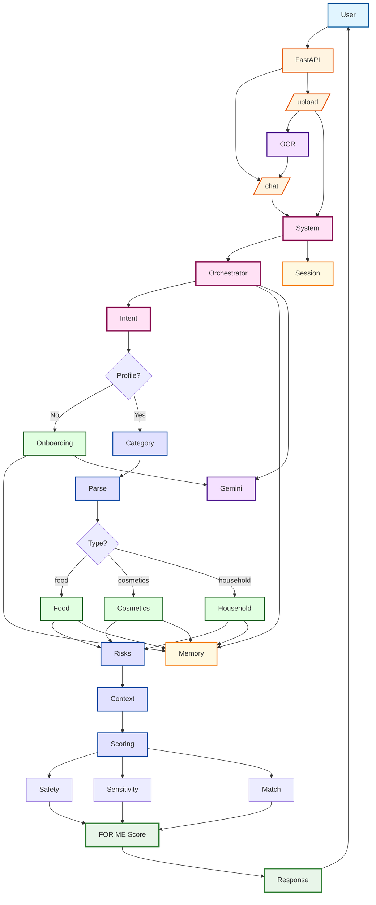

# ⭐ Project Overview — FOR ME

**FOR ME** is a production-grade, multi-agent AI system that transforms raw ingredient lists (cosmetics, food, household products) into personalized compatibility scores.

The core output — the **FOR ME Score (0–100%)** — reflects how well a product fits an individual user's allergies, sensitivities, and personal constraints.

**⚠️ Important:** FOR ME is not a medical system. All recommendations are based solely on user-provided data and non-medical domain rules.


## ⭐ Problem Statement

Ingredient lists are:
- **long**
- **multi-language**
- **inconsistent**
- and extremely confusing for the average user

Most existing tools give generic advice, ignoring:
- allergies
- personal sensitivities
- dietary restrictions
- skin/hair needs
- household safety preferences

Manually checking ingredients is:
- time-consuming
- error-prone
- exhausting — especially when managing multiple products

Users need a system that can instantly answer: **"Is this good for me?"**

## ⭐ Solution Statement

FOR ME is a multi-agent analysis system that:
- Parses multi-language ingredient lists
- Detects product categories
- Evaluates risks against user profiles
- Computes domain-specific safety, sensitivity, and match scores
- Generates a fully explainable FOR ME Score
- Learns from repeated negative reactions
- Provides user-friendly, non-medical explanations

This turns manual ingredient evaluation into an instant, structured, personalized decision.

## ⭐ Architecture Overview

FOR ME is built on a modular multi-agent architecture using the Google Agent Development Kit (ADK).

The system is coordinated by the **OrchestratorAgent**, which routes requests, manages profiles, and composes final outputs.

### System Architecture Diagram



### Agent Team

**🔹 Orchestrator — `orchestrator_agent`**
- Entry point for all user requests
- Detects intent
- Routes to onboarding, analysis, updates, or chat
- Aggregates results and formats responses

**🔹 Onboarding Specialist — `onboarding_agent`**
- Collects structured profile data through guided dialogue
- Allergies, sensitivities, dietary rules, skin/hair goals
- Stores validated profiles via `save_onboarding_profile`

**🔹 Profile Manager — `profile_agent`**
- Loads and saves long-term memory
- Manages multi-level profile schema: food, cosmetics, household
- Merges short-term and long-term context

**🔹 Category-Specific Analysts**
- `food_compatibility_agent`
- `cosmetics_compatibility_agent`
- `household_compatibility_agent`

Each implements domain scoring logic:
- **Food**: 50% safety · 30% sensitivity · 20% match
- **Cosmetics**: 30% safety · 30% sensitivity · 40% match
- **Household**: 40% safety · 30% sensitivity · 30% match

Outputs:
- Safety score
- Sensitivity score
- Match score
- Final FOR ME Score
- Issues & warnings

**🔹 Profile Update Specialist — `profile_update_agent`**
- Detects user-reported reactions
- Decides when to update long-term memory
- Maintains `repeated_negative_reactions` and preferences

## ⭐ Core Tools & Utilities

**Ingredients Parser — `parse_ingredients`**
- Multi-language normalization
- Handles OCR noise
- Converts raw messy text into clean ingredient lists

**Risk Dictionary — `get_ingredient_risks`**
- Maps ingredients → risk tags
- Used for safety and sensitivity scoring

**Category Detection — `detect_product_category`**
- Uses dictionaries, keyword counts, product hints
- Ensures correct routing to domain agents

**Product Analysis Tools — A2A tools**
- `analyze_food_product`
- `analyze_cosmetics_product`
- `analyze_household_product`

Each tool:
1. Loads user profile
2. Normalizes ingredients
3. Retrieves risk tags
4. Builds analysis context
5. Computes domain scores
6. Returns structured results

**Memory System — `memory.py`**
- Full separation of long-term and short-term memory
- Validations, defensive copying, type safety
- Repeated reaction logic integrated into scoring

**Observability — `observability.py`**
- Structured logging
- Metrics
- Request tracing
- Token usage and latency tracking

## ⭐ How It Works (Workflow)

1. **User Input** — Ingredient text or image (OCR)

2. **Intent Detection** — `ONBOARDING_REQUIRED` / `PRODUCT_ANALYSIS` / `PROFILE_UPDATE` / `SMALL_TALK`

3. **Onboarding (if needed)** — Collect allergies, sensitivities, goals

4. **Category Detection** — `food` / `cosmetics` / `household`

5. **Product Analysis** — Domain agent computes safety, sensitivity, match, and final score

6. **Explanation Formatting** — Friendly, structured breakdown

7. **Profile Updates (optional)** — Reactions → structured long-term memory updates

## ⭐ Value Statement

FOR ME converts chaotic ingredient lists into personalized compatibility insights within seconds.

The system:
- Handles multi-language inputs
- Applies domain rules
- Learns from user feedback
- Produces explainable scoring
- Shows clear warnings and recommendations

Users instantly understand:
- whether a product fits their restrictions
- why the score is what it is
- what risks exist
- and how to compare alternatives

## ⭐ Installation

This project was built against Python 3.11+.

It is suggested you create a virtual environment using your preferred tooling (e.g., `venv`, `uv`).

### 1. Create Virtual Environment

```bash
python -m venv venv
source venv/bin/activate  # On Windows: venv\Scripts\activate
```

### 2. Install Dependencies

```bash
pip install -r requirements.txt
```

### 3. Set API Key

**Option 1: Using .env file (Recommended)**

```bash
# Copy the template
cp .env.example .env

# Edit .env and add your API key
# GOOGLE_API_KEY=your-api-key-here
```

**Option 2: Environment variable**

```bash
export GOOGLE_API_KEY='your-api-key-here'
```

Get API key: https://aistudio.google.com/app/api-keys

> ⚠️ **Important**: Never commit `.env` file to git! It's already in `.gitignore`.

### 4. Run the Server

```bash
python main.py
```

The server will start on `http://localhost:8080`

### Running Tests

**Run the evaluation suite:**

```bash
python -m src.eval
```

**Run API tests:**

```bash
# Start server first
python main.py

# In another terminal
python test_api.py
```

**Run bot tests:**

```bash
python test_bot.py
```

## Project Structure

The project is organized as follows:

*   `src/`: The main Python package for the system.
    *   `system.py`: Defines the main `ForMeSystem` class and orchestrates all agents.
    *   `memory.py`: Implements long-term and short-term memory management.
    *   `observability.py`: Provides logging, metrics, and request tracing.
    *   `eval.py`: Contains the evaluation framework for quality testing.
    *   `types.py`: Defines common type aliases and TypedDict structures.
    *   `agents/`: Contains the individual agents, each responsible for a specific task.
        *   `orchestrator_agent.py`: Main coordinator that routes requests.
        *   `onboarding_agent.py`: Collects user profile through structured dialogue.
        *   `profile_agent.py`: Manages user profiles and memory.
        *   `profile_update_agent.py`: Analyzes user statements and proposes profile updates.
        *   `food_compatibility_agent.py`: Calculates compatibility scores for food products.
        *   `cosmetics_compatibility_agent.py`: Calculates compatibility scores for cosmetics.
        *   `household_compatibility_agent.py`: Calculates compatibility scores for household products.
        *   `scoring_agent.py`: General scoring logic (legacy, category agents now handle scoring).
        *   `explainer_agent.py`: Generates user-friendly explanations.
        *   `category_tools.py`: Tools for category detection and product analysis.
    *   `tools/`: Defines the custom tools used by the agents.
        *   `ingredient_parser.py`: Parses raw ingredient text into normalized lists.
        *   `risk_dictionary.py`: Maps ingredients to risk tags.
        *   `category_dictionaries.py`: Category-specific keyword dictionaries.
        *   `image_ocr.py`: OCR tool for extracting text from product images.
*   `main.py`: FastAPI server entrypoint.
*   `vertex_agent_entrypoint.py`: System initialization entrypoint for Cloud Run.
*   `deploy_to_cloud_run.py`: Deployment script for Google Cloud Run.
*   `tests/`: Contains unit tests and integration tests.
*   `docs/`: Contains documentation files.
    *   `ARCHITECTURE.md`: Detailed system architecture documentation.
    *   `ARCHITECTURE_DIAGRAM.md`: Mermaid diagrams for system architecture.
    *   `IMAGE_UPLOAD_GUIDE.md`: Guide for using image OCR feature.
*   `API_REFERENCE.md`: Complete API documentation for all endpoints.

## API Endpoints

Once the server is running, you can use these endpoints:

- `GET /health` - Health check
- `GET /` - API information
- `POST /chat` - Main chat endpoint (requires `X-User-Id` header)
- `POST /analyze` - Legacy analysis endpoint
- `POST /onboarding` - Start onboarding flow
- `POST /chat/upload` - Upload image for OCR analysis

**Example:**

```bash
curl -X POST http://localhost:8080/chat \
  -H "X-User-Id: test_user_001" \
  -H "Content-Type: application/json" \
  -d '{
    "message": "Analyze this shampoo",
    "ingredient_text": "Water, SLS, Glycerin, Fragrance",
    "product_domain": "cosmetics"
  }'
```

**📖 For complete API documentation, see [API_REFERENCE.md](./API_REFERENCE.md)**

## Documentation

- **[API Reference](./API_REFERENCE.md)** - Complete API documentation for all endpoints
- **[Architecture](./docs/ARCHITECTURE.md)** - Detailed system architecture and design
- **[Architecture Diagrams](./docs/ARCHITECTURE_DIAGRAM.md)** - Mermaid diagrams for visualization
- **[Image Upload Guide](./docs/IMAGE_UPLOAD_GUIDE.md)** - How to use image OCR feature
- **[Unit Tests](./tests/README.md)** - Test suite documentation

## Deployment

### Cloud Run

```bash
python deploy_to_cloud_run.py
```

### Docker

```bash
docker build -t for-me-agent .
docker run -p 8080:8080 -e GOOGLE_API_KEY=your-key for-me-agent
```

## Course Concepts Used

This project demonstrates:

- ✅ **Multi-Agent System** — 10 specialized agents working together
- ✅ **Agent-as-a-Tool (A2A)** — Orchestration pattern for agent composition
- ✅ **Tools** — Custom function tools (parser, risk dictionary, OCR)
- ✅ **Sessions & Memory** — Explicit long-term/short-term memory separation
- ✅ **Context Engineering** — Structured context building for agents
- ✅ **Observability** — Logging, metrics, and request tracing
- ✅ **Evaluation** — Behavioral quality gate for regression testing
- ✅ **Model & Tools Layer** — Gemini API + structured tools integration

## License

This project was created for educational purposes as part of the "5-Day AI Agents Intensive" course.

## Acknowledgments

Built with:
- Google Agent Development Kit (ADK)
- Gemini API
- FastAPI
- Google Cloud Run
