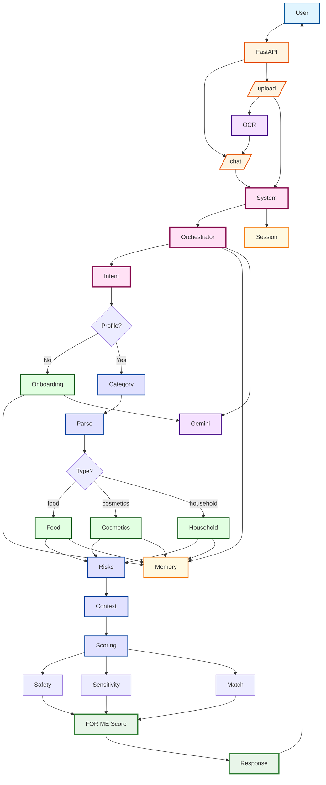

# ⭐ FOR ME — Personalized Ingredient Intelligence

*A production-grade multi-agent system for real-world compatibility analysis*

---

## 💔 The Moment That Inspired This Project

<<<<<<< HEAD
Most people genuinely try to choose the right product — but ingredient lists make it almost impossible.

A person buys a "gentle, nourishing" cream… only to discover drying alcohols hidden halfway down the INCI list.

Someone picks a protein bar with a clean-looking label… and misses the tiny "may contain traces of nuts" line blended into the packaging.

Someone with curly hair trusts a shampoo "for all hair types"… and ends up with dry, stripped strands — because the formula is loaded with sulfates.

Another person chooses a dish soap marketed as "safe for sensitive skin"… and reacts immediately to a preservative buried deep in the ingredient list.

None of these are bad decisions. The information people *need* is there — just not in a form designed for humans.

---

## 🌟 What FOR ME Does

FOR ME analyzes ingredient lists from **food, cosmetics, and household products** and transforms them into a **personalized FOR ME Score (0–100)** with clear, rule-based explanations.

It turns long, inconsistent, multilingual ingredient text into:

* a compatibility score tailored to the individual
* transparent reasoning
* ingredient-level insights
* non-medical, safe personalization

FOR ME does **not** analyze diseases, symptoms, or treatments. It is strictly a **consumer compatibility agent**, not a medical system.

---

## 🎯 Why Ingredient Lists Matter (But Nobody Reads Them)
=======
## ⭐ Problem Statement
>>>>>>> 36f61ba34c6f6ba4f8e67ef465e57b6113bd9e95

Ingredient lists are:

* long
* multi-language
* inconsistent
* full of synonyms
* and written for compliance, not clarity

Marketing promises simplicity:

**"For all skin types."**

**"Gentle."**

**"Clean."**

**"Safe for sensitive skin."**

But real compatibility is personal: your skin, your digestion, your allergies, your sensitivities, your reactions.

FOR ME reads what marketing doesn't say — and shows whether a product is good for **you**.

---

## 🧠 Why a Multi-Agent System?

Ingredient analysis is not a single task — it is a pipeline:

* parsing multilingual input
* category detection
* profile-aware constraints
* deterministic scoring
* safety routing
* explanation generation
* short-term personalization

One LLM cannot reliably do all of this with transparency and consistency.

A multi-agent architecture provides:

✔ separation of responsibilities  
✔ deterministic rule enforcement  
✔ transparent reasoning  
✔ safe medical boundary handling  
✔ modularity and extensibility

---

## 🏗️ Architecture

### High-Level Flow

```
User Input
     ↓
Orchestrator — intent & category detection
     ↓
Profile Manager — allergies / sensitivities / rules
     ↓
Domain Agent (food / cosmetics / household)
     ↓
Deterministic Scoring Engine
     ↓
Explainer Agent — user-friendly output
     ↓
Profile Update Agent — non-medical reactions
```

### System Architecture Diagram



### Agent Team

**🔹 Orchestrator**

* Classifies intent (analysis / onboarding / update / general)
* Detects category (food / cosmetics / household)
* Routes requests through the deterministic pipeline
* Assembles the final response

**🔹 Profile Manager**

* Loads and normalizes user constraints
* Maintains short-term memory of non-medical reactions
* Enforces strict separation of food/cosmetics/household rules

**🔹 Domain Compatibility Agents**

Each domain has its own logic and risk dictionaries.

* **Food Agent:** allergens, additives, traces, sugar alcohols
* **Cosmetics Agent:** fragrances, surfactants, preservatives, alcohols
* **Household Agent:** irritants, solvents, surfactants

**🔹 Explainer Agent**

Converts structured scoring into clear, human-friendly output: what triggered, why, how it affected the score.

**🔹 Profile Update Agent**

Learns from user feedback like:
* "this product made my skin feel tight"
* "this snack upset my stomach"

(non-medical; constraints only)

---

## 🧮 How the FOR ME Score Works

The system calculates three component scores, then combines them using category-specific weights.

### Component Scores

* **Safety Score (0-100):** Based on strict avoidances (allergens, critical constraints)
* **Sensitivity Score (0-100):** Based on prefer_avoid lists and irritants
* **Match Score (0-100):** Based on positive ingredients and user goals

### Domain Weighting

| Domain    | Safety | Sensitivity | Match | Rationale |
| --------- | ------ | ----------- | ----- | ---------- |
| **Food**  | 50%    | 30%         | 20%   | Safety is critical — allergens can be dangerous |
| **Cosmetics** | 30% | 30%      | 40%   | Match matters more — does it fit your hair/skin goals? |
| **Household** | 40% | 30%    | 30%   | Balanced approach — safety and effectiveness |

### Final Score Calculation

```
FOR ME Score = (Safety × weight) + (Sensitivity × weight) + (Match × weight)
```

The score is capped at 15 for strict allergens, ensuring safety is prioritized.

This makes scoring transparent, reproducible, and safe.

---

## 🛡️ Safety (Strictly Non-Medical)

If the system detects medical content — symptoms, diagnoses, medications — it triggers **Safety Redirect**:

* analysis stops
* FOR ME gives a generic safe message
* no medical inference is ever performed

This is enforced at multiple levels:
* Safety rules in every agent's instructions
* Dedicated Safety Redirect path in orchestrator
* Non-medical language in all outputs
* Explicit disclaimers in responses

---

## 🚦 End-to-End Workflow

1. User inputs ingredient text (or uploads photo for OCR)
2. Orchestrator detects intent + category
3. Parser normalizes multilingual text
4. Domain agent applies risk rules
5. Engine computes the FOR ME Score
6. Explainer formats the output
7. Memory updates non-medical reactions

Simple for the user. Complex under the hood. Fully transparent.

---

## 🧱 Tech Stack

* **LLM / Agents:** Gemini 2.5 Flash Lite + Google ADK
* **Backend:** FastAPI
* **Custom Tools:** parser, risk dictionary, scoring engine, OCR
* **Memory:** in-app profile + short-term personalization
* **Deployment:** Docker + Google Cloud Run
* **Observability:** Structured logging, metrics, request tracing

---

## 🚀 Quick Start

### Installation

```bash
# Create virtual environment
python -m venv venv
source venv/bin/activate  # On Windows: venv\Scripts\activate

# Install dependencies
pip install -r requirements.txt
```

### Set API Key

```bash
# Copy template
cp .env.example .env

# Edit .env and add your API key
# GOOGLE_API_KEY=your-api-key-here
```

Get API key: https://aistudio.google.com/app/api-keys

> ⚠️ **Important**: Never commit `.env` file to git! It's already in `.gitignore`.

### Run the Server

```bash
python main.py
```

Server starts on `http://localhost:8080`

### Test It

```bash
curl -X POST http://localhost:8080/chat \
  -H "X-User-Id: test_user_001" \
  -H "Content-Type: application/json" \
  -d '{
    "message": "Analyze this shampoo",
    "ingredient_text": "Water, SLS, Glycerin, Fragrance",
    "product_domain": "cosmetics"
  }'
```

**📖 For complete API documentation, see [API_REFERENCE.md](./API_REFERENCE.md)**

---

## 🔌 API Endpoints

### Main Endpoints

* `POST /chat` — Main chat endpoint (requires `X-User-Id` header)
* `POST /analyze` — Legacy analysis endpoint
* `POST /onboarding` — Start onboarding flow
* `POST /chat/upload` — Upload image for OCR analysis
* `GET /health` — Health check

### Example Request

```bash
POST /chat
Headers:
  X-User-Id: user_001
Body:
{
  "message": "Analyze this product",
  "ingredient_text": "aqua, glycerin, fragrance, parabens",
  "product_domain": "cosmetics"
}
```

### Example Response

```json
{
  "status": "success",
  "score": 45,
  "category": "cosmetics",
  "intent": "PRODUCT_ANALYSIS",
  "issues": [
    "Contains fragrance, which you've marked as a sensitivity",
    "Contains parabens, which may cause reactions"
  ],
  "reply": "This product has a FOR ME Score of 45/100. It contains fragrance and parabens, which may not be suitable for your sensitive skin profile."
}
```

---

## 📁 Project Structure

```
src/
  system.py               # Main system orchestrator
  memory.py               # Long-term/short-term memory
  observability.py        # Logging and metrics
  eval.py                 # Quality evaluation
  types.py                # Type definitions
  
  agents/
    orchestrator_agent.py      # Main coordinator
    onboarding_agent.py         # Profile collection
    profile_agent.py           # Profile management
    profile_update_agent.py    # Reaction learning
    food_compatibility_agent.py
    cosmetics_compatibility_agent.py
    household_compatibility_agent.py
    explainer_agent.py
    category_tools.py
    
  tools/
    ingredient_parser.py
    risk_dictionary.py
    category_dictionaries.py
    image_ocr.py

main.py                   # FastAPI entrypoint
tests/                    # Unit and integration tests
docs/                     # Architecture documentation
```

---

## 📚 Documentation

* **[API Reference](./API_REFERENCE.md)** - Complete API documentation
* **[Architecture](./docs/ARCHITECTURE.md)** - Detailed system design
* **[Architecture Diagrams](./docs/ARCHITECTURE_DIAGRAM.md)** - Mermaid diagrams
* **[Image Upload Guide](./docs/IMAGE_UPLOAD_GUIDE.md)** - OCR feature guide
* **[Unit Tests](./tests/README.md)** - Test suite documentation

---

## 🧪 Testing

```bash
# Run evaluation suite
python -m src.eval

# Run API tests (start server first)
python main.py
# In another terminal:
python test_api.py

# Run bot tests
python test_bot.py

# Run unit tests with coverage
pytest tests/ --cov=src --cov-report=html
```

---

## 🚀 Deployment

### Cloud Run

```bash
python deploy_to_cloud_run.py
```

### Docker

```bash
docker build -t for-me-agent .
docker run -p 8080:8080 -e GOOGLE_API_KEY=your-key for-me-agent
```

---

## 🎓 Course Concepts Demonstrated

This project showcases core concepts from the **5-Day AI Agents Intensive**:

✅ **Multi-Agent System** — 10+ specialized agents working together  
✅ **Agent-as-a-Tool (A2A)** — Agents invoked as tools for composable workflows  
✅ **Custom Tools** — Parser, risk dictionary, category detection, OCR  
✅ **Sessions & Memory** — Explicit long-term/short-term memory separation  
✅ **Context Engineering** — Structured context building for agents  
✅ **Observability** — Logging, metrics, and request tracing  
✅ **Agent Deployment** — Production-ready API on Google Cloud Run  
✅ **Type Safety** — Full type hints and TypedDict structures  

---

## 🧩 Competition Context — Why This Fits Concierge Agents

FOR ME is built for everyday decisions, not medical or enterprise use. It solves a real consumer pain:

**"Is this product actually good for me?"**

The project demonstrates:

* multi-agent routing
* tool use
* deterministic domain logic
* explainability
* safety governance
* memory
* real deployment

Exactly what the **Concierge Agents** category was created for.

---

## 🏁 Final Thought

Most people don't read ingredient lists.

Not because they don't care — but because the information wasn't designed for them.

FOR ME reads it for you.

And gives you something no label ever does:

**clarity, personalized.**

---

## 📝 License

This project was created for educational purposes as part of the "5-Day AI Agents Intensive" course.

---

## 🙏 Acknowledgments

Built with:
* Google Agent Development Kit (ADK)
* Gemini API
* FastAPI
* Google Cloud Run

---

*Built with ❤️ for the 5-Day AI Agents Intensive Capstone*
